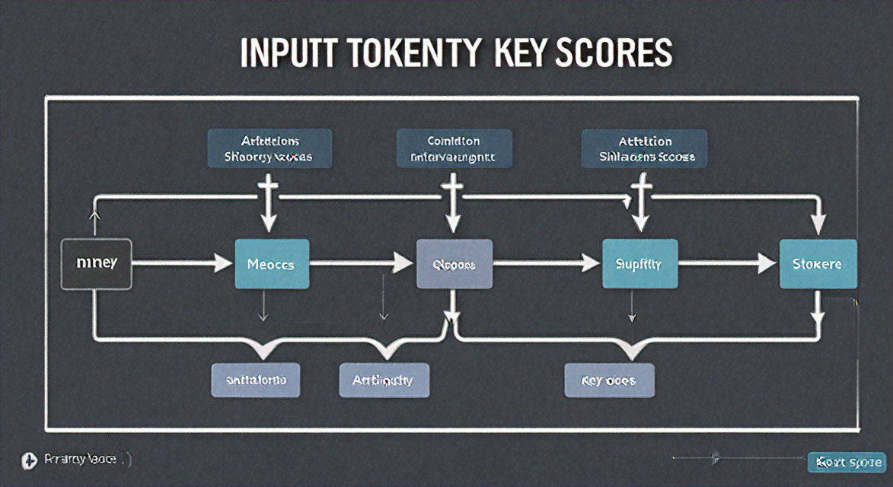
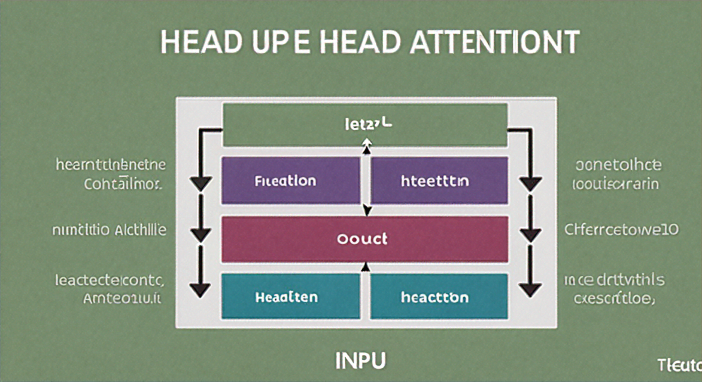

# Self-Attention in Transformer Architecture: A Deep Dive

## Why Self-Attention? The Problem with Sequential Processing

Before transformers dominated natural language processing, recurrent neural networks (RNNs) were the go-to architecture for sequence modeling. RNNs process input tokens one at a time, maintaining a hidden state that theoretically captures information from all previous tokens. This sequential dependency creates a fundamental bottleneck: you cannot compute the representation for token 100 until you've processed tokens 1 through 99. This serialization makes parallelization across the sequence dimension impossible, severely limiting training efficiency on modern hardware.

The sequential nature introduces another critical limitation: the vanishing gradient problem. As gradients backpropagate through many time steps, they often shrink exponentially, making it difficult for the model to learn relationships between distant tokens. While LSTM and GRU architectures mitigate this issue through gating mechanisms, they don't eliminate it. A word at position 5 that's semantically crucial for understanding a word at position 95 may have its signal degraded beyond usefulness.

Convolutional neural networks (CNNs) offered partial solutions by processing inputs in parallel through local receptive fields. However, CNNs have their own constraint: their receptive field is fixed by kernel size and layer depth. To capture long-range dependencies, you need either very deep networks or dilated convolutions, both of which increase computational complexity and introduce their own optimization challenges.

Self-attention takes a radically different approach. Instead of processing sequences step-by-step or through fixed windows, it allows every token to directly attend to every other token in a single operation. This design enables parallel computation across all positions while giving the model direct access to any dependency, regardless of distance. A token at the beginning of a sequence can immediately interact with one at the end, with the strength of that interaction learned from data rather than constrained by architecture.

## The Attention Mechanism: Queries, Keys, and Values

At the heart of self-attention lies a elegant mechanism built on three learned representations: **queries (Q)**, **keys (K)**, and **values (V)**. Each input token is transformed into all three representations through separate linear projections, and these three components work together to determine which parts of the input sequence deserve attention.


*The self-attention mechanism: input tokens are projected into Query, Key, and Value representations. Queries and Keys compute relevance scores, which are then used to create a weighted sum of Values.*

**The QKV Intuition**

Think of the attention mechanism as a differentiable database lookup. The **query** represents what information you're searching for—it encodes the question "what context do I need?" The **key** is what each token advertises about itself—it answers "what kind of information do I contain?" Finally, the **value** holds the actual information that gets retrieved and passed forward.

This database analogy maps directly to how attention operates: just as you might search a dictionary by matching your search term (query) against entry headings (keys) to retrieve definitions (values), attention matches queries against keys to retrieve relevant values.

**Computing Attention Weights**

The relevance between a query and each key is measured through a dot-product similarity calculation. For a given query vector, we compute its dot product with every key vector in the sequence. Higher dot products indicate stronger semantic alignment—tokens whose keys align well with the query are deemed more relevant.

These raw similarity scores then pass through a **softmax function**, which serves two critical purposes. First, it normalizes the scores into a valid probability distribution that sums to one across all positions. Second, it creates competition among tokens: softmax amplifies large scores and suppresses small ones, effectively forcing the model to make clear choices about which tokens matter most for the current context.

**Producing the Output**

The final step aggregates information by computing a weighted sum of all value vectors, where weights come from the softmax attention distribution. Tokens with high attention weights contribute more strongly to the output, while irrelevant tokens contribute minimally. This weighted combination becomes the attention output for that position, carrying forward a context-aware representation that blends information from across the sequence based on learned relevance patterns.

## Implementing Self-Attention from Scratch

Let's build a minimal self-attention implementation in PyTorch to cement the concepts. We'll work through each step methodically, tracking tensor shapes to ensure correctness.

### Setting Up Embeddings and Projection Matrices

First, we'll initialize our input embeddings and the three learned projection matrices (W_Q, W_K, W_V):

```python
import torch
import torch.nn as nn
import math

# Configuration
batch_size = 2
seq_length = 4
d_model = 8  # embedding dimension
d_k = d_model  # query/key dimension

# Input: random embeddings for demonstration
# Shape: (batch_size, seq_length, d_model)
x = torch.randn(batch_size, seq_length, d_model)

# Projection matrices
W_Q = nn.Linear(d_model, d_k, bias=False)
W_K = nn.Linear(d_model, d_k, bias=False)
W_V = nn.Linear(d_model, d_k, bias=False)

# Project input to Q, K, V
Q = W_Q(x)  # Shape: (2, 4, 8)
K = W_K(x)  # Shape: (2, 4, 8)
V = W_V(x)  # Shape: (2, 4, 8)

print(f"Q shape: {Q.shape}, K shape: {K.shape}, V shape: {V.shape}")
```

### Computing Scaled Attention Scores

Next, we compute the raw attention scores by multiplying Q with K^T, then scale by sqrt(d_k) to prevent gradient vanishing:

```python
# Compute attention scores: Q * K^T
# Transpose last two dims of K: (2, 4, 8) -> (2, 8, 4)
attention_scores = torch.matmul(Q, K.transpose(-2, -1))  # Shape: (2, 4, 4)

# Scale by sqrt(d_k) to stabilize gradients
attention_scores = attention_scores / math.sqrt(d_k)
print(f"Scaled attention scores shape: {attention_scores.shape}")
```

The scaling factor prevents the dot products from growing too large, which would push softmax into regions with extremely small gradients.

### Applying Softmax and Causal Masking

For decoder-style attention (like in GPT), we need to mask future positions. This ensures position i can only attend to positions ≤ i:

```python
# Create causal mask (upper triangular matrix of -inf)
mask = torch.triu(torch.ones(seq_length, seq_length) * float('-inf'), diagonal=1)
print(f"Causal mask:\n{mask}")

# Apply mask before softmax
attention_scores_masked = attention_scores + mask  # Broadcasting across batch

# Apply softmax to get attention weights
attention_weights = torch.softmax(attention_scores_masked, dim=-1)  # Shape: (2, 4, 4)
print(f"Attention weights shape: {attention_weights.shape}")
print(f"Sum of weights per row: {attention_weights[0].sum(dim=-1)}")  # Should be ~1.0
```

### Weighted Sum and Output

Finally, we compute the weighted sum of values using our attention weights:

```python
# Apply attention weights to values
output = torch.matmul(attention_weights, V)  # Shape: (2, 4, 8)
print(f"Output shape: {output.shape}")

# Verify: each output token is a weighted combination of all value vectors
print(f"First token output:\n{output[0, 0, :]}")
```

### Testing with a Simple Example

Let's verify with a concrete sequence:

```python
# Simple test: 3 tokens with d_model=4
test_input = torch.tensor([[[1., 0., 0., 0.],
                             [0., 1., 0., 0.],
                             [0., 0., 1., 0.]]])  # Shape: (1, 3, 4)

# Use identity matrices for W_Q, W_K, W_V to see pure dot-product attention
identity_proj = lambda x: x
Q_test = K_test = V_test = test_input

scores = torch.matmul(Q_test, K_test.transpose(-2, -1)) / math.sqrt(4)
weights = torch.softmax(scores, dim=-1)
output_test = torch.matmul(weights, V_test)

print(f"Test attention weights:\n{weights}")
print(f"Test output:\n{output_test}")
```

Each intermediate shape confirms our understanding: attention scores form a (seq_length × seq_length) matrix per batch, and the final output maintains the original (batch_size, seq_length, d_model) shape with context-enriched representations.

## Scaled Dot-Product Attention: Why the Scaling Factor Matters

The scaling factor in scaled dot-product attention isn't arbitrary—it addresses a fundamental numerical stability problem. When computing attention scores as dot products between query and key vectors, the magnitude of these scores grows proportionally with the dimension of the vectors.

Consider two random vectors **q** and **k** with dimension d_k, where each element is sampled from a distribution with mean 0 and variance 1. The dot product **q** · **k** = Σ(q_i × k_i) is a sum of d_k independent random variables. By the properties of variance, this sum has expected value 0 but variance d_k. As dimensionality increases, dot products spread over a wider range, producing very large positive or negative values.

This growth pushes the softmax function into saturation regions where exp(x) becomes extremely large or small. When softmax receives inputs like [50, 48, 49], it produces outputs very close to [1, 0, 0]—nearly one-hot distributions. The problem? Softmax gradients vanish in these regions. The gradient ∂softmax/∂x_i involves terms like p_i(1 - p_i), which approach zero when probabilities are near 0 or 1.

Here's a concrete example: without scaling, d_k=64 might produce pre-softmax scores like [8.2, 7.8, 8.0], yielding attention weights [0.55, 0.20, 0.25]. With scaling by √64 = 8, the scores become [1.03, 0.98, 1.00], producing more balanced weights [0.35, 0.32, 0.33]. The scaled version maintains gradient flow, allowing the model to learn nuanced attention patterns rather than collapsing to hard selections.

Dividing by √d_k normalizes the variance back to 1, keeping dot products in the linear region of softmax regardless of dimension. This simple operation is critical for training stability in high-dimensional transformer models.

## Multi-Head Attention: Parallel Representation Subspaces

Single-head attention, while powerful, forces all relationships to compete within a single representational space. Multi-head attention addresses this limitation by running multiple attention operations in parallel, allowing the model to jointly attend to information from different representation subspaces at different positions.


*Multi-head attention runs multiple attention operations in parallel, each learning different representation subspaces, then concatenates and projects the results.*

### Motivation for Parallel Heads

The core insight is that different types of relationships exist simultaneously in sequence data. A single attention mechanism must compress syntactic dependencies, semantic similarities, positional patterns, and other relationships into one set of attention weights. By splitting the model dimension across multiple heads, we enable the model to specialize: one head might focus on immediate predecessor-successor relationships, another on long-range thematic connections, and yet another on positional patterns.

### Projection into Separate Subspaces

Multi-head attention splits the model dimension `d_model` into `h` heads, each operating on `d_k = d_model / h` dimensions. For each head `i`, we apply separate learned linear projections:

```
Q_i = Q W^Q_i    where W^Q_i ∈ ℝ^(d_model × d_k)
K_i = K W^K_i    where W^K_i ∈ ℝ^(d_model × d_k)
V_i = V W^V_i    where W^V_i ∈ ℝ^(d_model × d_v)
```

Each head then computes attention independently in its reduced-dimension subspace. This dimensionality reduction keeps computational cost roughly constant compared to single-head attention with full dimensions, while gaining the benefits of multiple specialized attention patterns.

### Specialized Attention Patterns

Empirical analysis reveals that different heads learn remarkably distinct attention patterns. Some heads focus heavily on the previous token (capturing sequential dependencies), others attend broadly to sentence subjects or verbs (capturing grammatical structure), and still others exhibit position-based patterns or attend to rare tokens. This specialization emerges naturally during training without explicit supervision—each head discovers useful patterns through gradient descent.

### Combining Head Outputs

After each head produces its attention output, the results are concatenated and projected through a final learned linear transformation:

```
MultiHead(Q, K, V) = Concat(head_1, ..., head_h) W^O

where head_i = Attention(Q W^Q_i, K W^K_i, V W^V_i)
and W^O ∈ ℝ^(d_model × d_model)
```

This final projection allows the model to mix information across the different subspaces, combining the diverse patterns each head has detected.

### Computational Trade-offs

The relationship `d_k = d_model / h` creates an interesting trade-off. More heads enable richer pattern diversity but reduce per-head representational capacity. Standard configurations like 8 or 16 heads balance these concerns, though the optimal choice depends on task complexity and model size.

## Positional Encoding and Self-Attention

Self-attention has a fundamental limitation: it's **permutation-equivariant**. If you shuffle the input tokens, the attention mechanism produces shuffled outputs in the same order—it has no inherent notion of sequence position. Mathematically, if π is a permutation, then `Attention(π(X)) = π(Attention(X))`. This means self-attention treats input sequences like sets rather than ordered sequences, which is problematic for language and time-series data where order matters critically.

### Why Explicit Positional Encodings Are Necessary

Without position information, the sentence "the cat chased the dog" would be processed identically to "the dog chased the cat." To remedy this, transformers inject **positional encodings** directly into the input representations. These encodings provide each token with information about its absolute or relative position in the sequence.

### Adding Positional Information

Positional encodings are added element-wise to token embeddings before they enter the first attention layer:

```
input_to_attention = token_embedding + positional_encoding
```

The original Transformer paper introduced **sinusoidal encodings** using sine and cosine functions at different frequencies:

```
PE(pos, 2i) = sin(pos / 10000^(2i/d_model))
PE(pos, 2i+1) = cos(pos / 10000^(2i/d_model))
```

These deterministic encodings allow the model to attend to relative positions through linear combinations. Alternatively, **learned positional embeddings** treat position indices as trainable parameters, similar to token embeddings.

### Absolute vs. Relative Positioning

Absolute encodings assign each position a fixed representation. **Relative position representations** (like in T5 or ALiBi) directly bias attention scores based on the distance between tokens, making the model more robust to sequence length variations. Relative approaches often generalize better because they encode the structural relationship "how far apart are these tokens?" rather than absolute indices.

### Length Extrapolation Challenges

Models trained with absolute positional encodings struggle when inferencing on sequences longer than training examples—the model hasn't learned representations for unseen position indices. Relative position methods and techniques like RoPE (Rotary Position Embeddings) improve extrapolation by encoding positions in ways that maintain meaningful representations at novel sequence lengths.

## Attention Patterns and Common Failure Modes

Understanding what healthy attention looks like is crucial for debugging transformer models. When you visualize attention weights, three common patterns emerge that reveal how your model is processing information.


*Visualizing common attention patterns: diagonal patterns show local focus, uniform patterns indicate uncertainty, and peaked patterns reveal specific token emphasis.*

**Normal Attention Patterns:**

- **Diagonal/local patterns**: Attention weights concentrate near the diagonal of the attention matrix, indicating the model focuses on nearby tokens. This is common in early layers and suggests local dependency learning.
- **Uniform patterns**: Nearly equal attention weights across all positions signal uncertainty or that the model hasn't learned meaningful relationships yet. This is normal during early training but problematic if it persists.
- **Peaked patterns**: Sharp spikes in attention weights show the model has learned to focus on specific, relevant tokens. This typically appears in later layers for task-specific features.

**Attention Collapse**

One of the most insidious problems is attention collapse, where multiple attention heads converge to learn nearly identical patterns. This wastes model capacity since heads should specialize in different aspects of the input. You can detect this by computing pairwise similarity between attention weight matrices across heads—if most heads show >0.9 correlation, you're losing representational diversity.

**Diffuse vs. Over-Concentrated Attention**

Attention that's too diffuse (entropy too high) fails to extract meaningful signal, while over-concentration (entropy near zero) creates brittle dependencies on single tokens. Monitor attention entropy: values consistently above 0.8 × log(seq_len) suggest diffusion issues, while values near zero indicate over-focusing.

**Special Token Attention Sink**

Transformers often develop an attention sink where models dump attention weights onto special tokens like [CLS] or [SEP], even when they're irrelevant to the task. This happens because the model needs somewhere to route attention when no other token is contextually important—special tokens become a "no-op" destination.

The placement of layer normalization significantly affects this behavior. Pre-norm architectures (LayerNorm before attention) tend to be more stable and reduce attention sink severity compared to post-norm designs, where the phenomenon is more pronounced in deeper layers.

## Computational Complexity and Memory Considerations

The self-attention mechanism's primary computational bottleneck lies in its **quadratic complexity with respect to sequence length**. For a sequence of length `n` with embedding dimension `d`, computing the attention scores requires matrix multiplication of Q and K^T, each of shape `(n, d)`. This multiplication produces an `(n, n)` attention matrix, requiring **O(n²d)** floating-point operations. The subsequent softmax and value weighting add O(n²) and O(n²d) operations respectively, maintaining the quadratic time complexity. Memory-wise, storing the attention matrix alone requires **O(n²)** space, which becomes the dominant memory consumer for long sequences.

To illustrate the concrete impact: a sequence of 512 tokens with batch size 16 and 8 attention heads produces attention matrices totaling `16 × 8 × 512 × 512 = 33.5 million` float32 values, consuming approximately **134 MB** just for attention scores. Doubling the sequence length to 1024 quadruples this to **536 MB**. This quadratic growth forces a critical trade-off in GPU memory allocation: increasing batch size for training efficiency directly competes with supporting longer sequences, as both dimensions multiply against the O(n²) attention memory.

The computational cost balance shifts dramatically with sequence length. Feed-forward layers typically have O(nd²) complexity (where d is embedding dimension and hidden dimension is proportional to d). For short sequences where n << d, feed-forward layers dominate computation. However, as sequences grow longer, attention computation overtakes feed-forward costs. At n = 1024 with d = 512, attention operations can consume 2-3× more compute time than feed-forward layers in standard transformer blocks.

To address these limitations, researchers have developed **efficient attention variants** that break the quadratic barrier:

- **Sparse attention** (e.g., Longformer, BigBird) limits each token to attend only to local neighbors or stride patterns, reducing complexity to O(n·k) where k << n
- **Linear attention** approximations use kernel methods to avoid explicitly materializing the attention matrix, achieving O(nd²) complexity
- **Local windowing** restricts attention to fixed-size neighborhoods, maintaining O(n·w·d) complexity for window size w

These techniques enable processing sequences of 4K-16K tokens while maintaining practical memory footprints, though often with task-specific trade-offs in model quality.

## Self-Attention vs Cross-Attention: When to Use Each

While self-attention has been our primary focus, transformers employ two distinct attention patterns that serve different architectural purposes. Understanding when to use each is crucial for designing effective models.

**Cross-attention** differs fundamentally from self-attention in its information flow. Instead of attending within a single sequence, cross-attention pulls queries from one sequence while drawing keys and values from a different sequence. The query matrix Q comes from the target representation, while K and V come from the source representation. This creates a bridge between two different information sources, enabling the model to condition its output on external context.

**Self-attention in encoder blocks** processes sequences bidirectionally, allowing each token to attend to all other tokens in both directions. This unrestricted attention enables the encoder to build rich, context-aware representations. Every position can gather information from past and future tokens simultaneously, making encoders ideal for understanding tasks where full context matters.

**Masked self-attention in decoder blocks** enforces causality for autoregressive generation. By applying an upper triangular mask to the attention scores, we prevent positions from attending to future tokens. Each position can only look at itself and previous positions, ensuring that predictions at timestep t depend solely on tokens 1 through t. This maintains the autoregressive property necessary for sequential generation.

**Cross-attention in encoder-decoder architectures** connects these components for conditional generation. The decoder uses cross-attention layers where queries come from the decoder's representation and keys/values come from the encoder's output. This allows the decoder to selectively focus on relevant parts of the input while generating output.

Concrete examples clarify these patterns:

- **Machine translation** uses encoder-decoder with cross-attention. The encoder processes the source language bidirectionally, while the decoder generates target language tokens autoregressively, using cross-attention to align with source tokens.
- **Language modeling** (like GPT) uses only masked self-attention in decoder-only architecture, predicting the next token based solely on previous context.
- **BERT** employs only bidirectional self-attention in an encoder-only architecture, learning deep contextual representations for understanding tasks like classification and question answering.